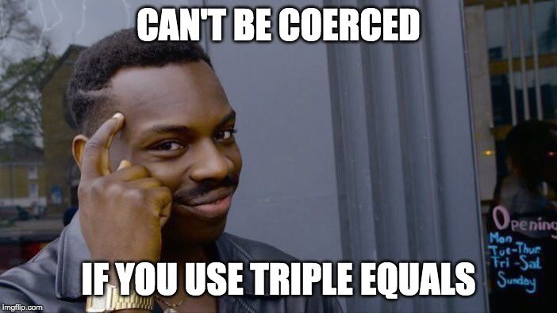

## First Thoughts

At the time of writing this paper I’ve only been exposed to javascript for about a week, but to my surprise, this language was very simple and convenient to use. My previous coding experiences were with java, C, and C++, following my school’s ICS curriculum, but I was never fond of those languages. They posed some challenges for me, not so much with algorithms, but more with the implementation and syntax like the use of pointers. At the start of this semester, we hit the ground running with this new language, javascript, and having to learn all the new rules was alarming but fortunately this style was made easy enough for anybody to pick up and that was as relief.   

## This I Like

Just in the first week, this class expected us to learn javascript and write code with it, which was overwhelming but using freeCodeCamp really helped. After going through the lessons, I found this language very reminiscent of C and C++, but with the added benefit of ES6. Typecasting in other languages was frustrating, writing headers seemed redundant even though it was necessary, and assigning return and parameter types did feel a bit like a chore, making javascript seem like a piece of cake in comparison. As of now, I prefer javascript because there’s a lot of potential in ES6 to create awesome and efficient code.

## Week One, Done

This class has also taught us the concept of athletic software engineering to help practice javascript and improve our coding. The idea behind it is to write code for short problems in a given amount of time, and with me not being an exceptionally skilled programmer, coupled with my inexperience in javascript, needless to say, it made me anxious and unconfident. Naturally, I was slower than average at solving these WODs, and submitting a few of them incomplete was stressful, but I do enjoy this style of learning. I learn best when actually creating code and this method lets me do that while increasing my speed which I’m lacking in. I look forward to the rest of this course because so far it’s given me a superior programming language, and an effective strategy to learn code. 
