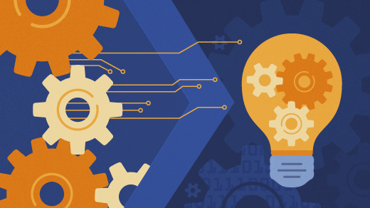
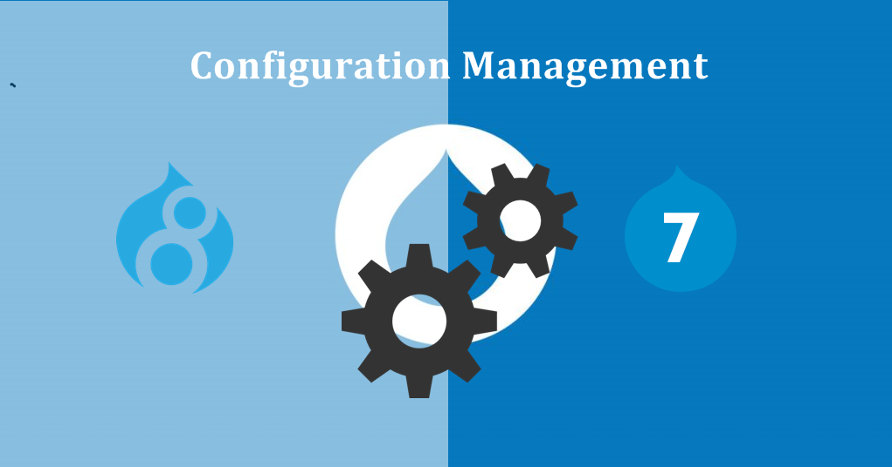
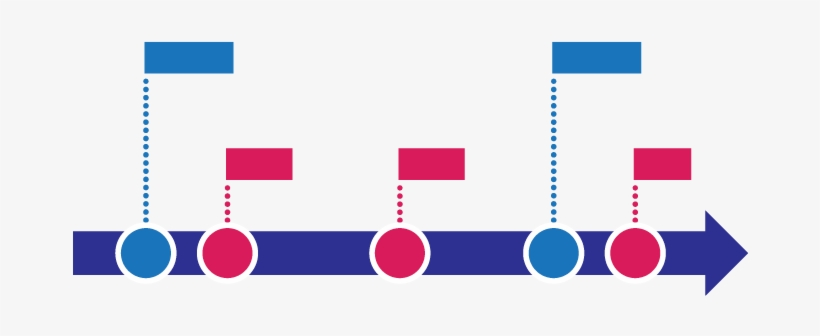

## Tools of Success

During my time studying software engineering, I’ve picked up on many powerful concepts and tools that were beneficial to my learning and these concepts would be extremely useful even outside of web development. For me, the two major takeaways from this course would be configuration management and agile project management because, had I known these concepts in my past programming experiences my code would have been a lot more efficient with a better functionality.

## Reset Button

Configuration management works as a form of error checking, making sure all the elements of the configuration of a system functions properly. For web development, we utilized version control as a backup to return to when things go wrong beyond our capabilities of fixing it. I found myself using version control a lot especially when first learning software development when I didn’t understand how certain code worked. Github was our go to for this method, and this application was extremely useful with its capabilities of making branches off of a master branch. With this method, you would always have an outdated but working version that you can update once your new code works as intended. For our final project in software engineering we worked in groups to develop a website and that’s where I got to see the full potential of configuration management. It made splitting up the work easier and updating the master branch more organized. Through Github you could also see the history of other collaborators which made error checking simple and efficient. I’ll definitely be using this concept and Github in the future, in both web development and software engineering.

## Break it Down

Agile project management is another method that we used through Github, specifically with issue driven project management. This method breaks down a project into sections or “milestones”, and those are broken down into specific issues in a group setting to improve efficiency. We used this process for my final project which benefited our productivity and kept each task organized. We made each issue a branch on Github so each member would be able to make changes at the same time without interfering with one another. Using this method, we were able to keep track of each other's progress and solve merge conflicts as soon as they appeared, making the development process clear and efficient. The future of a computer scientist will rely on group coordination, and this strategy will help facilitate the process since these tools can be carried over to other programming aspects, both in group projects or even individually.

## Takeaway

In conclusion, configuration management is an organization tool that simplifies error checking and keeps track of the development process through version control and agile project management breaks down requirements into manageable subtasks. These tools that I learned from web development are things that I could utilize in any field of computer science, and these concepts are also applicable in other aspects of my life with its efficiency as an individual and in a group setting.
